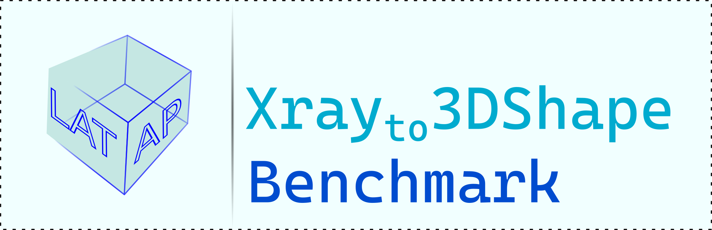

<div id="top"></div>
<!--
*** Thanks for checking out the Best-README-Template. If you have a suggestion
*** that would make this better, please fork the repo and create a pull request
*** or simply open an issue with the tag "enhancement".
*** Don't forget to give the project a star!
*** Thanks again! Now go create something AMAZING! :D
-->

<!-- PROJECT SHIELDS -->

<!--
*** I'm using markdown "reference style" links for readability.
*** Reference links are enclosed in brackets [ ] instead of parentheses ( ).
*** See the bottom of this document for the declaration of the reference variables
*** for contributors-url, forks-url, etc. This is an optional, concise syntax you may use.
*** https://www.markdownguide.org/basic-syntax/#reference-style-links
-->
<!-- PROJECT LOGO -->

<br />
<div align="center">
    

<!-- <h3 align="center">Xrayto3D-Benchmark</h3> -->


<p align="center">
    <strong>Xrayto3DShape</strong>: A Benchmark for Biplanar X-rays to 3D Shape Reconstruction
  <br />
  <a href="https://arxiv.org/abs/2309.13587">Paper</a>
  ·
  <a href="results">Benchmark</a>
  .
  <!-- <a href="external/XrayTo3DPreprocess/workflow/readme.md">Preprocess</a>
  .
  <a href="external/xrayto3D-morphometry/README.md">Morphometry</a>
  . -->
  <a href="docs/sample_evaluation.ipynb">Code Example</a>
  <!-- · -->
  <!-- <a href="docs">Docs</a>
  · 
  <a href="">Video</a> -->
  </p>
</div>

<!-- TABLE OF CONTENTS -->

<details>
  <summary>Table of Contents</summary>
  <ol>
    <li><a href="#intro">Introduction</a></li>
    <li>
      <a href="#getting-started">Getting Started</a>
      <ul>
        <li><a href="#prerequisites">Prerequisites</a></li>
        <li><a href="#installation">Installation</a></li>
      </ul>
    </li>
    <li><a href="#usage">Usage</a></li>
    <li><a href="#benchmark-results">Benchmark Results</a></li>
    <li><a href="#model-zoo">Model Zoo</a></li>
    <li><a href="#contributing">Community</a></li>
    <li><a href="#license">License</a></li>
    <li><a href="#acknowledgments">Acknowledgments</a></li>
  </ol>
</details>

<!-- News and Updates -->

## News and Updates

- [02/09/2024] We have released the trained models. [[Trained Models](https://naamii-my.sharepoint.com/:f:/g/personal/mahesh_shakya_naamii_org_np/EpApYbexnSRHvRbntrA9ODEBlFlYt-4sjRjMoGz5GbNOpQ?e=Mz27X4)]

- [02/09/2024] Benchmark evaluation logs and results of Xrayto3D benchmark has been updated! [[Results](results)] [[wandb]](https://wandb.ai/msrepo/2d-3d-benchmark)

- [12/20/2023] The Xrayto3D benchmark paper has been accepted at NeurIPS 2023 Dataset and Benchmark Track! [[Openreview](https://openreview.net/forum?id=NoE8g3LRAM)]


# Xrayto3D-benchmark
This is a pytorch-based Python package for Biplanar X-ray to 3D Shape Reconstruction. We aim to become a comprehensive benchmarking tool for developing and evaluating methods and architectures
specific to this problem. 

Currently, we provide tools to train and evaluate on 4 different bone anatomies, using publicly available CT-segmentation datasets. We also define tasks for domain shifts to evaluate the robustness of these methods. 

Various Encoder-Decoder Architectures on volumetric grid-based representation are reimplemented and benchmarked.


#### Getting Started
---
##### Prerequisites
To install the required packages
```bash
conda env create  --name xrayto3dbenchmark-cuda_11 --file  benchmark-requirements-cuda_11.yaml
# or
conda env create  --name xrayto3dbenchmark-cuda_10 --file  benchmark-requirements-cuda_10.yaml
conda activate ...
```
Install the XrayTo3DShape package
```bash
pip install XrayTo3DShape  
```
Sample Training script call
```sh
python train.py  configs/paths/femur/30k/TotalSegmentor-femur-left-DRR-30k_train+val.csv configs/paths/femur/30k/TotalSegmentor-femur-left-DRR-30k_test.csv --gpu 0 --tags model-compare --size 128 --batch_size 4 --accelerator gpu --res 1.0 --model_name MultiScale2DPermuteConcat --epochs -1 --loss DiceLoss  --lr 0.002 --steps 4000 --dropout
```

#### Prepare Datasets
A separate repo for preprocessing data has been created [here](https://github.com/naamiinepal/XrayTo3DPreprocess). The instructions for downloading and processing datasets are described [here.](https://github.com/naamiinepal/XrayTo3DPreprocess/blob/main/workflow/readme.md)

#### Usage
---
Examples to help you get familiar with the XrayTo3DShape package for quick use, evaluate an existing architecture on your own dataset, or benchmark new architectures.

##### Quick Start
- Beginning Examples
  - [Sample Model Prediction](docs/sample_evaluation.ipynb)
- [Customize Datasets](docs/dataset.md)
- [Regarding Orientation alignment between Input X-rays and Output Segmentation](docs/orientation.md)

#### Training
See `bash_scripts` dir

#### Evaluation
- [Domain Shift](docs/Domain_Shift_Evaluation.md)
- [Angle Perturbation](docs/Angle_Perturbation_evaluation.md)
#### Benchmark Results
[wandb results page](https://wandb.ai/msrepo/2d-3d-benchmark)

#### Model Zoo
TODO: Add pre-trained models


#### Acknowledgements
We took considerable inspiration and references from:
- [USB](https://github.com/microsoft/Semi-supervised-learning)
- [MONAI](github.com/project-MONAI/MONAI)

Various adaptation of code(or code snippets) from these sources:
- [FracReconNet](https://github.com/DanupongBu/FracReconNet)
- [VerSe](https://github.com/anjany/verse)
- [torch-template](https://github.com/shagunsodhani/torch-template)

Various sections of the code uses following external codebases:
- [SpatialConfiguration-Net](https://github.com/christianpayer/MedicalDataAugmentationTool-VerSe)
- [surface-distance](https://github.com/deepmind/surface-distance)
- [TotalSegmentator](https://github.com/wasserth/TotalSegmentator)
