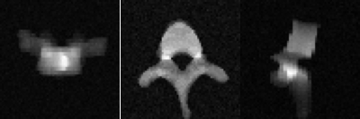
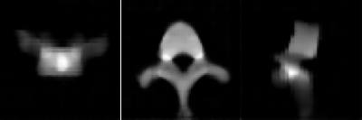

## Architectures Notes

## OneDConcat: Chen Model
Encode AP and LAT images into their own low-dim embedding space. Concatenate these low-dim embedding and decode into a 3D volume.
This architecture requires images to be power-of-2. (i.e. image of size (96,96) is not allowed). This is because the decoder expands the 1D-vector into 3D volume in power-of-2. The number of decoder layers is equal to log-base-2(image_size).

## TL-Embedding (Giridhar et. al 2016)
### Autoencoder

Top: Noisy Image, Mid: Autoencoder output, Bottom: Actual Clean Image
   