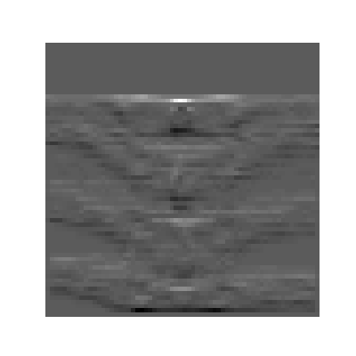
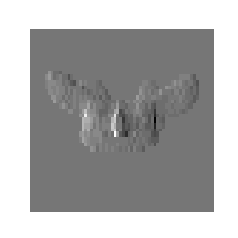
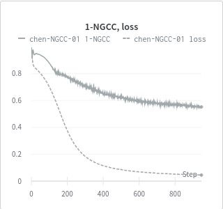

## Custom Loss function Notes

## Normalized Gradient Cross-Correlation (1 - NGCC)
In our real dataset sample, this loss can get as low as 0.5.
Gradients of AP and LAT images are correlated with Projections of Predicted Segmentations as shown below.

The NGCC seems to be well-correlated with other losses like cross-entropy and Dice.