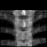
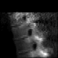
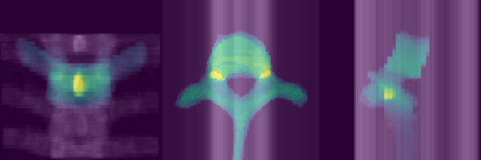
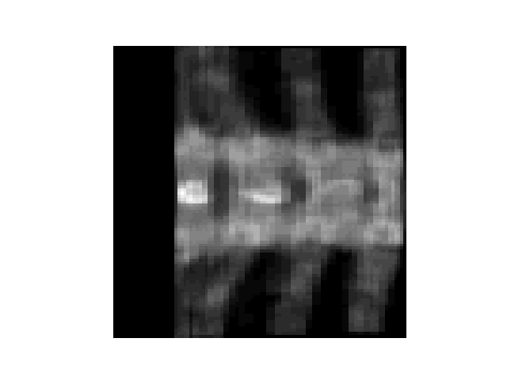
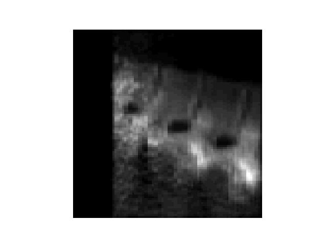

## Orientation Notes

One of the pain points of setting up a Biplanar X-ray to 3D Segmentation dataset is to maintain orientation of the predicted segmentation and the groundtruth orientation.

Here, we assume that the Biplanar X-ray are in standing left-to-right, anterior-to-posterior orientation.

 
 
 
The 3D Segmentation volume may be oriented in a defined axcode. When these images go through the model pipeline, we get a 3D segmentation volume. These two groundtruth and predicted volume has to **pixel-aligned** in their underlying internal-array representation to obtain performance metrics.




The image above shows alignment between projection of 3D segmentation volume and AP(top) and LAT(bottom) images.

## How do we achieve this?
As mentioned earlier, we always pass-in the Biplanar X-ray images in their original viewing orientation.

When loading the image using default args `monai.transforms.LoadImage(reader=PILReader(converter=None))`, the `imagereader` returns a `numpy array` which may look like below.




We can now add additional argument to PILReader to rotate the AP image to pixel-align the X-ray views to the 3D Segmentation.

For example, if the 3D Segmentation is in `PIR` orientation. This requires rotating the AP image by 90 degree clockwise.
```python
PILReader(converter=lambda image: image.rotate(90))
```

The final transformation corresponding to `PIR` oriented 3D segmentation is


```python
    lidc_ap_transform = Compose([
        LoadImageD(keys={'img'},ensure_channel_first=False,dtype=np.uint8, simple_keys=True,image_only=False,reader=PILReader(converter=lambda image: image.rotate(90))),
        LambdaD(keys={'img'},func=lambda t: einops.repeat(t, 'm n -> k m n', k=96))
    ]) 

    lidc_lat_transform = Compose([
        LoadImageD(keys={'img'},ensure_channel_first=False,dtype=np.uint8, simple_keys=True,image_only=False,reader=PILReader(converter=None)),
        LambdaD(keys={'img'},func=lambda t: einops.repeat(t, 'm n -> m n k', k=96))
    ])

    lidc_seg_transform = Compose([
        LoadImageD(keys={'seg'},ensure_channel_first=True,dtype=np.uint8,simple_keys=True,image_only=False),
        SpacingD(keys={'seg'},pixdim=(1,1,1),mode='nearest',padding_mode='zeros',),
        SpatialPadD(keys={'seg'},spatial_size=(96,96,96)),
        OrientationD(keys={'seg'},axcodes='PIR'),
    ])
```